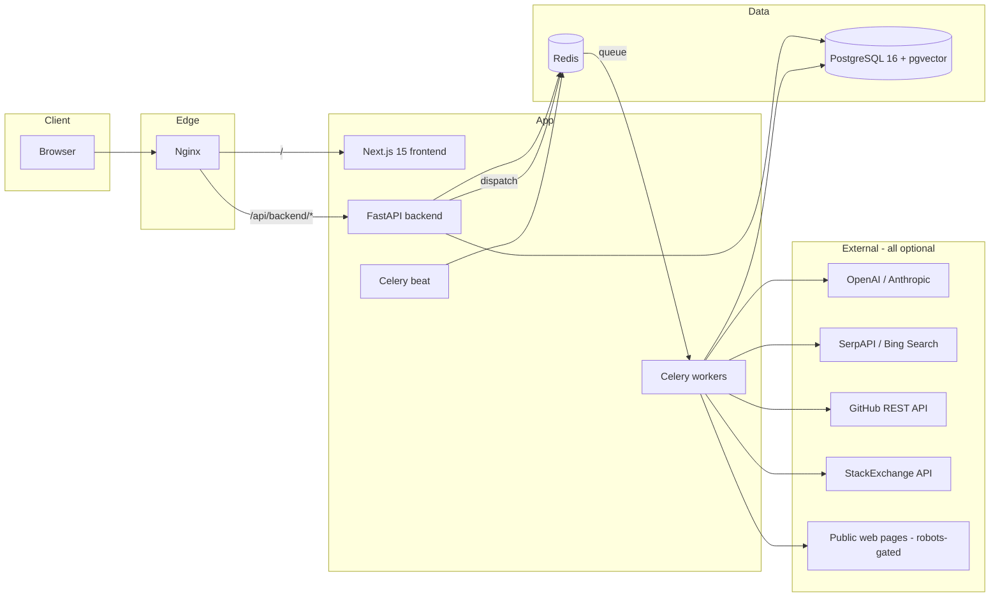
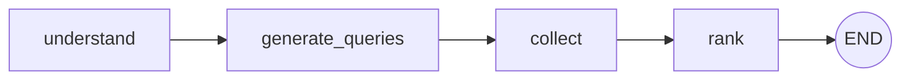
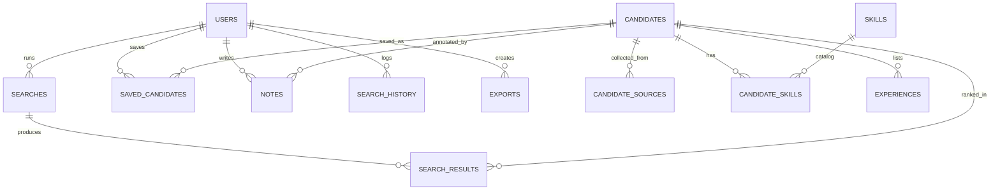

# Architecture

## System overview



## The search pipeline (LangGraph)

Every search runs the same explicit state machine, whether on a Celery worker
or the inline fallback:



| Stage | Module | What happens | Fallback without keys |
|---|---|---|---|
| `understand` | `app/ai/understanding.py` | NL query → `ParsedRequirement` (titles, skills, seniority, years, locations, industry, employment type, remote) | Curated-taxonomy regex parser (`app/ai/heuristics.py`) |
| `generate_queries` | `app/ai/query_generation.py` | Per-source optimized queries; source relevance gating (Behance only for design roles, Kaggle for data roles, …); LLM adds creative variants | Deterministic templates only |
| `collect` | `app/scraping/pipeline.py` | Parallel search across providers → URL dedupe → per-hit enrichment → normalize → identity-merge dedupe | Sample-data provider (profiles flagged `is_sample`) |
| `rank` | `app/services/search_service.py` | Persist candidates (dedup-hash upsert), embed, deterministic score breakdown + semantic similarity, AI summary/explanation, store `SearchResult` rows | Hashing-vectorizer embeddings + template narratives |

Search status transitions are persisted at each stage (`pending → understanding
→ searching → collecting → ranking → completed|failed`) so the frontend can
poll and render live progress.

## Backend layering (clean architecture)

```
app/
├── core/           # config (pydantic-settings), logging, security, middleware, exceptions
├── db/             # async engine/session, declarative base, portable Vector/JSONB types
├── models/         # SQLAlchemy 2 ORM — the domain
├── schemas/        # Pydantic v2 request/response contracts
├── repositories/   # persistence access (Repository Pattern)
├── services/       # business logic (auth, search orchestration, ranking, exports, analytics)
├── ai/             # provider abstraction + understanding/query-gen/extraction/narrative/embeddings/graph
├── scraping/       # compliant collection pipeline + pluggable sources
├── tasks/          # Celery app, tasks, broker-aware dispatch
└── api/            # deps (DI) + versioned routers
```

Rules: routers never touch the ORM directly; services own transactions;
repositories own queries; `app/ai` and `app/scraping` are framework-free.

## Data model



Key columns:

- `candidates.dedup_hash` — SHA-256 identity anchor (LinkedIn/GitHub URL or
  public email, else name+company). Upserts **merge**: existing values win,
  gaps fill, confidence takes the max.
- `candidates.embedding` — `vector(1536)` on PostgreSQL (JSON-encoded on
  SQLite for tests); cosine kNN via pgvector.
- `search_results` — one row per (search, candidate) with the full 0–100 score
  breakdown, rank, matched/missing skills, AI summary + explanation.

## Ranking model

`RankingService` is pure/deterministic. Overall = weighted blend (weights sum
to 1.0):

| Component | Weight | Signal |
|---|---|---|
| skill_match | 0.28 | required skills/keywords vs candidate skills+technologies (fuzzy containment) |
| experience_match | 0.15 | years vs required min/max + seniority alignment |
| technology_match | 0.15 | required tech/frameworks/languages overlap |
| location_match | 0.12 | city (100) / country (90–100) / unknown-under-constraint (40) |
| portfolio_score | 0.08 | portfolio/website presence, bio richness, social links |
| github_activity_score | 0.10 | log-scaled repos/followers/stars |
| relevance_score | 0.12 | embedding cosine similarity (or deterministic blend) |

## Scraping compliance design

- `RobotsGate` fetches/caches robots.txt per host (1 h TTL) and blocks
  disallowed URLs before any fetch.
- `RespectfulHTTPClient` enforces a global concurrency semaphore, per-host
  minimum delay, tenacity retries with exponential backoff, configurable UA
  and optional forward proxy.
- **Official APIs first**: GitHub REST and StackExchange enrichers never
  scrape HTML. Search goes through licensed APIs (SerpAPI/Bing).
- **LinkedIn**: `LinkedInSnippetEnricher` parses only the public search-result
  title/snippet; `linkedin.com` is on the generic fetcher's skip list, so the
  site is never requested.
- Fetch results cached in Redis (in-memory fallback) to avoid re-hitting
  sources on repeated searches.

## Background processing

- Celery queues: `search` (pipeline runs) and `maintenance` (beat: re-embed
  missing vectors every 6 h, purge expired exports/failed searches daily).
- `app/tasks/dispatch.py` probes the broker (cached 30 s): Redis up → Celery;
  down → FastAPI background task, so single-process dev still works.
- Each task builds a **task-local engine** (NullPool) inside its own event
  loop — asyncpg pools must never cross loops.

## Frontend structure

```
src/
├── app/            # App Router: login/register + (app)/{dashboard,search,candidates,[id],saved,history,analytics,settings}
├── components/
│   ├── ui/         # shadcn-style primitives (button, card, dialog, table, …)
│   ├── layout/     # sidebar, topbar (theme toggle, user menu)
│   ├── search/     # search progress stepper
│   └── candidates/ # candidate card (score ring, links, save)
├── hooks/use-api.ts# TanStack Query hooks (search polling, mutations)
├── lib/api.ts      # typed fetch client, refresh-on-401, file downloads
├── store/          # Zustand: auth (persisted tokens/user), ui
└── types/api.ts    # backend contract mirror
```

The browser only ever calls `/api/backend/*`: Next.js rewrites it in dev,
Nginx routes it in production — no CORS in either case, backend origin stays
server-side configuration.
